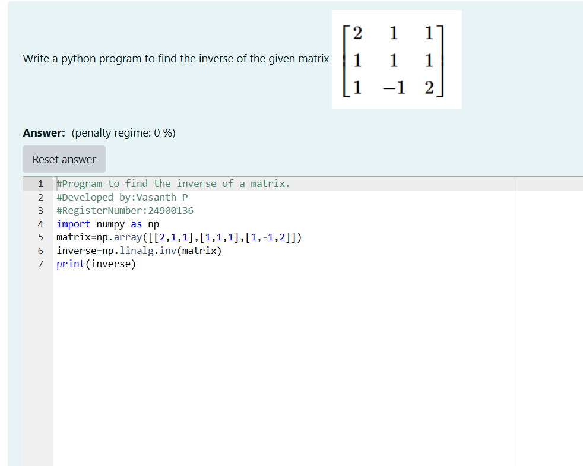
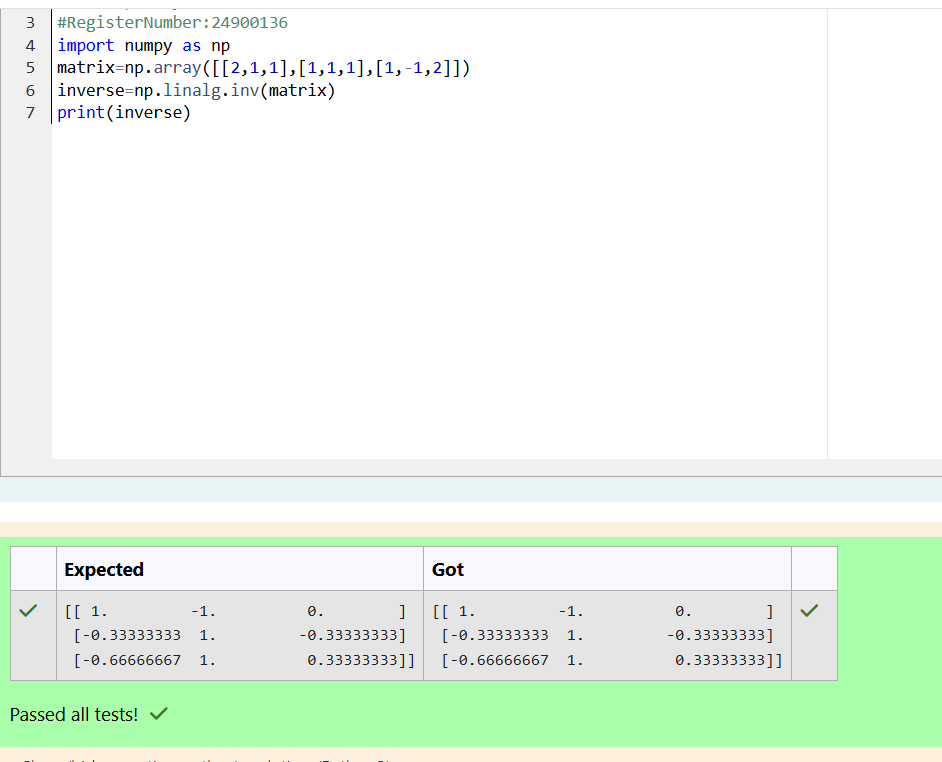

# INVERSE-OF-A-MATRIX
## Aim:
To write a python program to find the inverse of a matrix
## Equipment’s required:
1. 	Hardware – PCs
2. 	Anaconda – Python 3.7 Installation / Moodle-Code Runner
## Algorithm:
### Step1 : Import the numpy module to use the built in function for calculation
### Step 2: Prepare the lists from each linear equations and asign in np.array()
### Step 3:Using the n.linalg.inv(),we can find the inverse of the given matrix
### Step 4: End the program

## Program:
```
program to find inverse of the matrix
developed by:Vasanth P
RegisterationNumber:24900136
import numpy as np
matrix=np.array([[2,1,1],[1,1,1],[1,-1,2]])
inverse=np.linalg.inv(matrix)
print(inverse)
```
## Output:


## Result:
Thus the inverse of given matrix is successfully solved using python program

